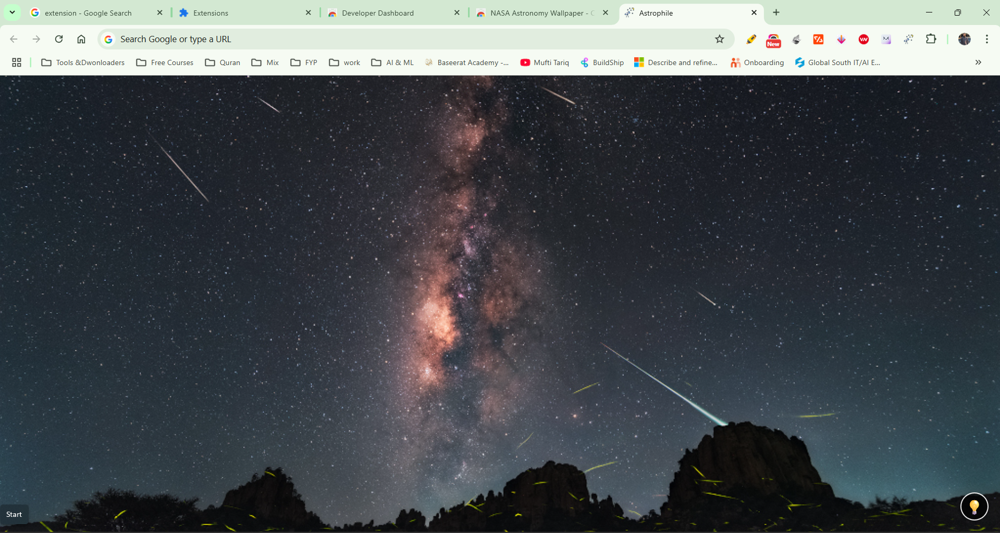

# Astronomy Wallpaper - A Chrome Extension 

Transform your new tab into a daily cosmic experience!
NASA Astronomy Wallpaper is a simple yet fascinating Chrome extension that sets NASA's Astronomy Picture of the Day (APOD) as your new tab background.

> Get it on chrome store : [Click Here](https://chromewebstore.google.com/detail/nasa-astronomy-wallpaper/gjbbpalnahkmlcockfhnnpieaehjicmi?utm_source=item-share-cb)

----
### Features

🌌 Daily Space Wallpaper : See a stunning astronomical image every time you open a new tab, sourced directly from NASA’s APOD API.

💡 Learn More: Click the bulb icon to read a short explanation about the image and explore the science behind the scene.

🔭 Built for Space Lovers: Whether you're a stargazer, astronomy enthusiast, or just enjoy gorgeous visuals, this extension brings the universe closer—one tab at a time.

----
### How It Works
This Chrome extension uses NASA’s public API to fetch the latest Astronomy Picture of the Day and sets it as the background for every new tab.

### Installation for Local Development
* Clone or download this repository.
* Go to chrome://extensions/ in your browser.
* Enable Developer Mode (top right).
* Click Load unpacked and select the extension directory.
* Open a new tab to see the magic!
---

### Credits
NASA APOD API
Inspired by the beauty of the cosmos ✨
